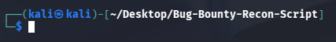
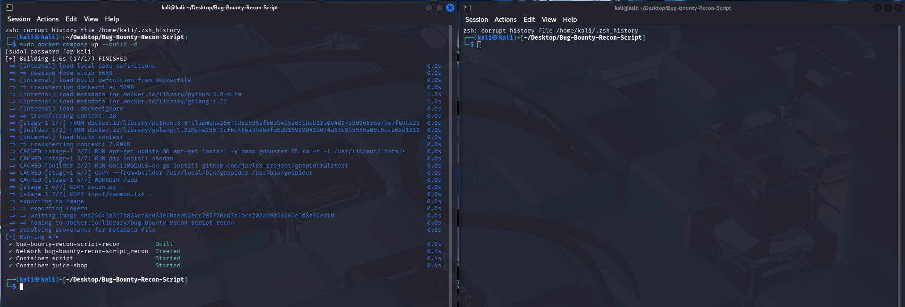
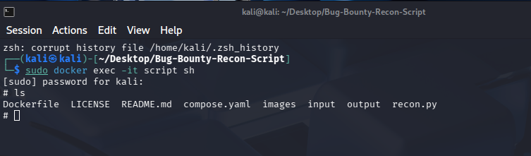
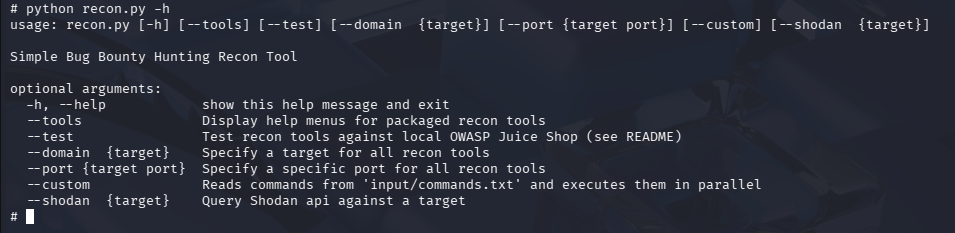

# <h1 align="center">Bug-Bounty-Recon-Script</h1>

## Description
This script uses nmap, gospider and gobuster to perform non-intrusive recon on a target domain, intended for Bug Bounty Hunting. The script is intended to be used within a Docker image, but it not required. 

https://nmap.org/docs.html | https://github.com/jaeles-project/gospider | https://github.com/Oj/gobuster
    

### Script Flags
    FLAGS:
        --help: Display help menu for recon.py script
        --tools: Display help menus for packaged recon tools
        --test: Test recon tools against local OWASP Juice Shop (requires docker-compose up)
        --domain {target}: Specify a target for all recon tools
        --port {target port}: Specify a specific port for all recon tools 
        --custom: Reads commands from 'input/commands.txt' and executes them in parallel
        --shodan {target}: Query Shodan api against a target 

    RECON TOOL DEFAULT FLAGS:
        nmap -sV -sS -oN output/nmap.txt {target domain}
        gospider -s {target domain} -d 1 -c 2 -t 2 -q --output output/gospider-output
        gobuster gobuster dir -u {target domain} -w input/common.txt -t 1 -o output/gobuster.txt

## Getting Started
**Check if Docker is installed on your system (LINUX ONLY, USE DOCKER DESKTOP IF ON WINDOWS)** 

`docker --version` 

**If Docker is not installed, run these commands:** 

1. `sudo apt update` 
2. `sudo apt install docker.io` 
3. `sudo systemctl start docker` 
4. `sudo systemctl enable docker` 
5. `sudo systemctl status docker` 

**Test docker installation:** 

`sudo docker run hello-world`

## Setting up Docker Images

**If you would like to bundle OWASP juice-shop together with the script for testing, run the bellow commands:** 

1. `git clone https://github.com/rleviathan5/Bug-Bounty-Recon-Script.git`

2.  Open a terminal in cloned repo:

    

3. `sudo docker-compose up --build -d` 

4. Open seperate terminal for ease:

    

5. `sudo docker exec -it script sh` 

6. At this point, if you 'ls' you'll see the repo files:

    

7. `python recon.py -h`

    

