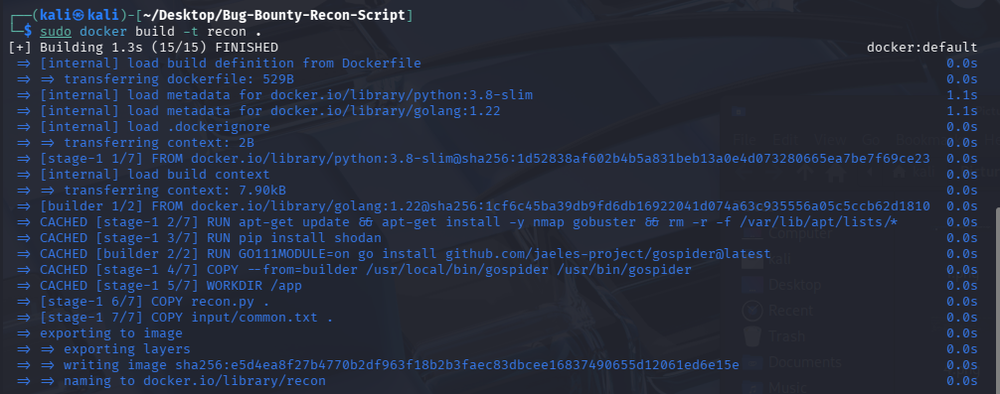
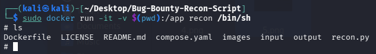
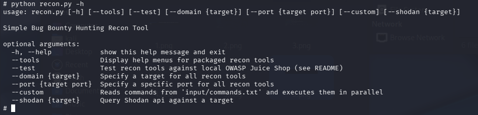

## Description
This script uses nmap, gospider and gobuster to perform non-intrusive recon on a target domain, intended for Bug Bounty Hunting. The script is intended to be used within a Docker image, but it not required.<br>

https://nmap.org/docs.html | https://github.com/jaeles-project/gospider | https://github.com/Oj/gobuster
    
### Script Flags
    FLAGS:
        --help: Display help menu for recon.py script
        --tools: Display help menus for packaged recon tools
        --test: Test recon tools against local OWASP Juice Shop (requires docker-compose up)
        --domain {target}: Specify a target for all recon tools
        --port {target port}: Specify a specific port for all recon tools 
        --custom: Reads commands from 'input/commands.txt' and executes them in parallel
        --shodan {target}: Query Shodan api against a target 

    RECON TOOL DEFAULT FLAGS:
        nmap -sV -sS -oN output/nmap.txt {target domain}
        gospider -s {target domain} -d 1 -c 2 -t 2 -q --output output/gospider-output
        gobuster gobuster dir -u {target domain} -w input/common.txt -t 1 -o output/gobuster.txt

## Getting Started
**Check if Docker is installed on your system (LINUX ONLY, USE DOCKER DESKTOP IF ON WINDOWS)**<br>

`docker --version`<br>

**If Docker is not installed, run these commands:**<br>

1. `sudo apt update`<br>
2. `sudo apt install docker.io`<br>
3. `sudo systemctl start docker`<br>
4. `sudo systemctl enable docker`<br>
5. `sudo systemctl status docker`<br>

**Test docker installation:**<br>

`sudo docker run hello-world`

## Setting up Docker Images
**If you want to bundle OWASP juice-shop together with the script for testing, run the bellow commands:**<br>

1. `git clone https://github.com/rleviathan5/Bug-Bounty-Recon-Script.git`

2.  Open a terminal in cloned repo:

    <p align="center"></p>

3. `sudo docker-compose up --build -d`

4. Open seperate terminal for ease:

    <p align="center"></p>

5. `sudo docker exec -it script sh`

6. At this point, if you 'ls' you'll see the repo files:

    <p align="center"></p>

7. `python recon.py -h`

    <p align="center"></p>

---

**If you want to just run the script without OWASP juice-shop, run the below commands:**
1. Open a terminal in cloned repo:

    <p align="center"></p>

2. `sudo docker build -t recon .`

    <p align="center"></p>

3. `sudo docker run -it -v $(pwd):/app recon /bin/sh`

    <p align="center"></p>

4. `python recon.py -h`

     <p align="center"></p>

## Usage Examples
`python recon.py --test --port 3000`<br> 
Only for sampling output against an authorised target - must be using docker-compose up which hosts juice-shop on port 3000

Nmap Ouput:
```text
# Nmap 7.93 scan initiated Sun Apr 26 16:22:09 2026 as: nmap -sV -sS -oN output/nmap.txt juice-shop.local
Nmap scan report for juice-shop.local (172.18.0.3)
Host is up (0.000014s latency).
rDNS record for 172.18.0.3: juice-shop.bug-bounty-recon-script_recon
Not shown: 999 closed tcp ports (reset)
PORT     STATE SERVICE VERSION
3000/tcp open  ppp?
1 service unrecognized despite returning data. If you know the service/version, please submit the following fingerprint at https://nmap.org/cgi-bin/submit.cgi?new-service :
SF-Port3000-TCP:V=7.93%I=7%D=4/26%Time=69EE3BBD%P=x86_64-pc-linux-gnu%r(Ge
SF:tRequest,3890,"HTTP/1\.1\x20200\x20OK\r\nAccess-Control-Allow-Origin:\x
SF:20\*\r\nX-Content-Type-Options:\x20nosniff\r\nX-Frame-Options:\x20SAMEO
SF:RIGIN\r\nFeature-Policy:\x20payment\x20'self'\r\nX-Recruiting:\x20/#/jo
SF:bs\r\nAccept-Ranges:\x20bytes\r\nCache-Control:\x20public,\x20max-age=0
SF:\r\nLast-Modified:\x20Sun,\x2026\x20Apr\x202026\x2016:19:05\x20GMT\r\nE
SF:Tag:\x20W/\"124fa-19dca965d92\"\r\nContent-Type:\x20text/html;\x20chars
SF:et=UTF-8\r\nContent-Length:\x2075002\r\nVary:\x20Accept-Encoding\r\nDat
SF:e:\x20Sun,\x2026\x20Apr\x202026\x2016:22:21\x20GMT\r\nConnection:\x20cl
SF:ose\r\n\r\n<!--\n\x20\x20~\x20Copyright\x20\(c\)\x202014-2026\x20Bjoern
SF:\x20Kimminich\x20&\x20the\x20OWASP\x20Juice\x20Shop\x20contributors\.\n
SF:\x20\x20~\x20SPDX-License-Identifier:\x20MIT\n\x20\x20-->\n\n<!doctype\
SF:x20html>\n<html\x20lang=\"en\"\x20data-beasties-container>\n<head>\n\x2
SF:0\x20<meta\x20charset=\"utf-8\">\n\x20\x20<title>OWASP\x20Juice\x20Shop
SF:</title>\n\x20\x20<meta\x20name=\"description\"\x20content=\"Probably\x
SF:20the\x20most\x20modern\x20and\x20sophisticated\x20insecure\x20web\x20a
SF:pplication\">\n\x20\x20<meta\x20name=\"viewport\"\x20content=\"width=de
SF:vice-width,\x20initial-scale=1\">\n\x20\x20<link\x20id=\"favicon\"\x20r
SF:el=\"icon\"\x20")%r(Help,2F,"HTTP/1\.1\x20400\x20Bad\x20Request\r\nConn
SF:ection:\x20close\r\n\r\n")%r(NCP,2F,"HTTP/1\.1\x20400\x20Bad\x20Request
SF:\r\nConnection:\x20close\r\n\r\n")%r(HTTPOptions,EA,"HTTP/1\.1\x20204\x
SF:20No\x20Content\r\nAccess-Control-Allow-Origin:\x20\*\r\nAccess-Control
SF:-Allow-Methods:\x20GET,HEAD,PUT,PATCH,POST,DELETE\r\nVary:\x20Access-Co
SF:ntrol-Request-Headers\r\nContent-Length:\x200\r\nDate:\x20Sun,\x2026\x2
SF:0Apr\x202026\x2016:22:21\x20GMT\r\nConnection:\x20close\r\n\r\n")%r(RTS
SF:PRequest,EA,"HTTP/1\.1\x20204\x20No\x20Content\r\nAccess-Control-Allow-
SF:Origin:\x20\*\r\nAccess-Control-Allow-Methods:\x20GET,HEAD,PUT,PATCH,PO
SF:ST,DELETE\r\nVary:\x20Access-Control-Request-Headers\r\nContent-Length:
SF:\x200\r\nDate:\x20Sun,\x2026\x20Apr\x202026\x2016:22:21\x20GMT\r\nConne
SF:ction:\x20close\r\n\r\n");
MAC Address: 6A:28:E2:4A:62:69 (Unknown)

Service detection performed. Please report any incorrect results at https://nmap.org/submit/ .
#Nmap done at Sun Apr 26 16:22:21 2026 -- 1 IP address (1 host up) scanned in 11.97 seconds
```

Gobuster Output:

```text
/.well-known/security.txt (Status: 200) [Size: 475]
/Video                (Status: 200) [Size: 10075518]
/api                  (Status: 500) [Size: 3011]
/api/experiments      (Status: 500) [Size: 3035]
/api/experiments/configurations (Status: 500) [Size: 3065]
/apis                 (Status: 500) [Size: 3013]
/assets               (Status: 301) [Size: 156] [--> /assets/]
/ftp                  (Status: 200) [Size: 11307]
/media                (Status: 301) [Size: 155] [--> /media/]
/profile              (Status: 500) [Size: 1043]
/promotion            (Status: 200) [Size: 6459]
/redirect             (Status: 500) [Size: 3113]
/rest                 (Status: 500) [Size: 3013]
/restaurants          (Status: 500) [Size: 3027]
/restore              (Status: 500) [Size: 3019]
/restored             (Status: 500) [Size: 3021]
/restricted           (Status: 500) [Size: 3025]
/robots.txt           (Status: 200) [Size: 28]
/security.txt         (Status: 200) [Size: 475]
/video                (Status: 200) [Size: 10075518]
```

Gospider Output:

```text
http://juice-shop.local:3000/ftp
http://juice-shop.local:3000
http://juice-shop.local:3000/ftp
[href] - http://juice-shop.local:3000/assets/public/favicon_js.ico
[href] - http://juice-shop.local:3000/styles.css
[href] - http://juice-shop.local:3000/chunk-24EZLZ4I.js
[href] - http://juice-shop.local:3000/chunk-T3PSKZ45.js
[href] - http://juice-shop.local:3000/chunk-4MIYPPGW.js
[href] - http://juice-shop.local:3000/chunk-LHKS7QUN.js
[href] - http://juice-shop.local:3000/chunk-TWZW5B45.js
[javascript] - http://juice-shop.local:3000/polyfills.js
[javascript] - http://juice-shop.local:3000/scripts.js
[javascript] - http://juice-shop.local:3000/main.js
[href] - http://juice-shop.local:3000/
[href] - http://juice-shop.local:3000/ftp
[href] - http://juice-shop.local:3000/ftp/quarantine
[href] - http://juice-shop.local:3000/ftp/acquisitions.md
[href] - http://juice-shop.local:3000/ftp/announcement_encrypted.md
[href] - http://juice-shop.local:3000/ftp/coupons_2013.md.bak
[href] - http://juice-shop.local:3000/ftp/eastere.gg
[href] - http://juice-shop.local:3000/ftp/encrypt.pyc
[href] - http://juice-shop.local:3000/ftp/incident-support.kdbx
[href] - http://juice-shop.local:3000/ftp/legal.md
[href] - http://juice-shop.local:3000/ftp/package-lock.json.bak
[href] - http://juice-shop.local:3000/ftp/package.json.bak
[href] - http://juice-shop.local:3000/ftp/suspicious_errors.yml
http://juice-shop.local:3000/ftp
http://juice-shop.local:3000
http://juice-shop.local:3000/ftp
[href] - http://juice-shop.local:3000/assets/public/favicon_js.ico
[href] - http://juice-shop.local:3000/styles.css
[href] - http://juice-shop.local:3000/chunk-24EZLZ4I.js
[href] - http://juice-shop.local:3000/chunk-T3PSKZ45.js
[href] - http://juice-shop.local:3000/chunk-4MIYPPGW.js
[href] - http://juice-shop.local:3000/chunk-LHKS7QUN.js
[href] - http://juice-shop.local:3000/chunk-TWZW5B45.js
[javascript] - http://juice-shop.local:3000/polyfills.js
[javascript] - http://juice-shop.local:3000/scripts.js
[javascript] - http://juice-shop.local:3000/main.js
[href] - http://juice-shop.local:3000/
[href] - http://juice-shop.local:3000/ftp
[href] - http://juice-shop.local:3000/ftp/quarantine
[href] - http://juice-shop.local:3000/ftp/acquisitions.md
[href] - http://juice-shop.local:3000/ftp/announcement_encrypted.md
[href] - http://juice-shop.local:3000/ftp/coupons_2013.md.bak
[href] - http://juice-shop.local:3000/ftp/eastere.gg
[href] - http://juice-shop.local:3000/ftp/encrypt.pyc
[href] - http://juice-shop.local:3000/ftp/incident-support.kdbx
[href] - http://juice-shop.local:3000/ftp/legal.md
[href] - http://juice-shop.local:3000/ftp/package-lock.json.bak
[href] - http://juice-shop.local:3000/ftp/package.json.bak
[href] - http://juice-shop.local:3000/ftp/suspicious_errors.yml
```

---

`python recon.py --domain {target}`

This command will run:<br>
    `nmap -sV -sS -oN output/nmap.txt {target domain}`<br>
    `gospider -s {target domain} -d 1 -c 2 -t 2 -q --output output/gospider-output`<br>
    `gobuster gobuster dir -u {target domain} -w input/common.txt -t 1 -o output/gobuster.txt`<br>

---

`python recon.py --shodan {target}`

[View info from Shodan query](output/shodan_clean.json)
[View CVEs from Shodan query](output/shodan_cves.json)

